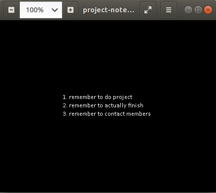

# Intro
Your friend was trying to send you the stuff that he did for your group project, but the data mysteriously got corrupted. He said his computer got infected before he was able to send it. Regardless of what happened, you need to fix it or you won't be able to complete the project.

## Initial Research
First I tried to understand what type of file the corrupted file is:

```bash
spags@ubuntu:~/Downloads/tj/corrupt$ file dc3b12c1155ea3c09800ebec00f8d31498af64fe6f76e0c75a552ff2c75cc762_corrupted_project 
dc3b12c1155ea3c09800ebec00f8d31498af64fe6f76e0c75a552ff2c75cc762_corrupted_project: data
```

I realized using a hex editor would be easier at this point. Here we can see some strings for ZIP files. From other CTF challenges I know that ZIP files usually start with PK ZIP (a specific type of zip format). Knowing this I google'd the specs for PK ZIP. 


https://users.cs.jmu.edu/buchhofp/forensics/formats/pkzip.html


## Byte Editing
After reading the spec sheet I notice that a PKZip header has a signature of "\x50\x4b\x03\x04". As we see in the screenshot below, the hex values are "\x2e\x4b\x03\x04".


I changed the files first byte from \x2e to \x50, then ran “file” on the new binary.

``` bash
spags@ubuntu:~/Downloads/tj/corrupt$ file p1 
p1: Zip archive data
```

I try to unzip the directory but no luck.

``` bash
spags@ubuntu:~/Downloads/tj/corrupt$ unzip p1
Archive:  p1
  End-of-central-directory signature not found.  Either this file is not
  a zipfile, or it constitutes one disk of a multi-part archive.  In the
  latter case the central directory and zipfile comment will be found on
  the last disk(s) of this archive.
unzip:  cannot find zipfile directory in one of p1 or
        p1.zip, and cannot find p1.ZIP, period.
```

After reading the error that the End-of-central-directory signature was not found, I do some more research. The spec sheet states the End-of-central-directory ends with '\x50\x4b\x05\x06'. If we search for this byte string in the file, it doesn't exist. Knowing this, I decided to make my own zip file and compare the bytes. In the captures below we can see the difference between the corrupted zip file and my test file.


I also found that the distance from '\x55\x54' or "UT" to the End-of-central-directory signature is 22 bytes according to our test zip file. If we look at the corrupted ZIP file it ends after 22 bytes from UT. After realizing this add the End-of-central-directory record from my test ZIP to the corrupted one.

```bash
spags@ubuntu:~/Downloads/tj/corrupt$ unzip p2
Archive:  p2
warning [p2]:  2697 extra bytes at beginning or within zipfile
  (attempting to process anyway)
error [p2]:  start of central directory not found;
  zipfile corrupt.
  (please check that you have transferred or created the zipfile in the
  appropriate BINARY mode and that you have compiled UnZip properly)
 ```

 Now, the start-of-central directory can't be found. I search for the start-of-central directory '\x50\x4b\x01\x02'. It exists in the corrupted file, so I start to look more into the End-of-central-directory entry and determine that two values are off: Central directory size and Offset of cd wrt to starting disk. I calculate the central directory size in the screenshot below.


Note the Central directory size is 87 in decimal and convert it to 57 hex. The screenshot also shows the Offset of cd wrt to starting disk is AC8.


I edit the entry to be the following:


```bash
spags@ubuntu:~/Downloads/tj/corrupt$ unzip p2
Archive:  p2
   skipping: project-files.zip       unsupported compression method 4671
```

Now unzip failes and reports the compression method is unsupported. I convert decimal 4671 to hex 123F and search for it in the file. It takes me back to the PK ZIP header. The compression method field must be changed to the correct value. I check the spec sheet and determine '\x00\x00' represents no compression, so we replacce 123F with 0000. The byte pattern search also took us back to the End-of-central directory, so I edit its compression method field as well.


I try to unzip the correct file:

```bash
spags@ubuntu:~/Downloads/tj/corrupt$ unzip p2
Archive:  p2
project-files.zip:  ucsize 2804 <> csize 2685 for STORED entry
         continuing with "compressed" size value
 extracting: project-files.zip        bad CRC c301c9a4  (should be 2e8854ea)
```

At least one CRC within the zip file is corrupted, so we can search for the crc byte value (2e8854ea) in the corrupted ZIP file and replace it with the correct CRC returned by unzip "bad CRC c301c9a4".


Finally the file unzips:

```bash
spags@ubuntu:~/Downloads/tj/corrupt$ unzip p2
Archive:  p2
project-files.zip:  ucsize 2804 <> csize 2685 for STORED entry
         continuing with "compressed" size value
replace project-files.zip? [y]es, [n]o, [A]ll, [N]one, [r]ename: y
 extracting: project-files.zip 
```

```bash
spags@ubuntu:~/Downloads/tj/corrupt$ file project-files.zip 
project-files.zip: data
```

The contents of the unzipped file are also broken, so we have to fix it. I break out the hex editor and try to learn more about the file.


After looking at the file header we can see "BZ". Given that the first file was a ZIP file I assumed BZ is probably the header for bunzip2. After some google-ing I confirmed this suspicion. Just like the ZIP file I create my own Bunzip2 archive and compare the byte values. The header magic for Bunzip2 is "BZh" but our corrupted file has the header "BZe". So, I start by changing that value.


```bash
spags@ubuntu:~/Downloads/tj/corrupt$ bunzip2 project-files.zip
bunzip2: Can't guess original name for project-files.zip -- using project-files.zip.out

bunzip2: Data integrity error when decompressing.
	Input file = project-files.zip, output file = project-files.zip.out

It is possible that the compressed file(s) have become corrupted.
You can use the -tvv option to test integrity of such files.

You can use the `bzip2recover' program to attempt to recover
data from undamaged sections of corrupted files.

bunzip2: Deleting output file project-files.zip.out, if it exists.
```

```bash
spags@ubuntu:~/Downloads/tj/corrupt$ bunzip2 -tvv project-files.zip
  project-files.zip: data integrity (CRC) error in data
```

After trying to unbunzip there are CRC issues. When doing further byte comparison we can see that the BZ2 header doesn’t have the correct compressed magic values. Lets correct it:


Now we can Bunzip without errors:

```bash
spags@ubuntu:~/Downloads/tj/corrupt$ bunzip2 ft.zip -tvv
  ft.zip:  
    [1: huff+mtf rt+rld]
    ok
```

```bash
spags@ubuntu:~/Downloads/tj/corrupt$ file ft.zip.out 
ft.zip.out: Zip archive data, at least v2.0 to extract
```

I unzip the archive inside the Bunzip archive and there are no errors:

```bash
spags@ubuntu:~/Downloads/tj/corrupt$ unzip ft.zip.out
Archive:  ft.zip.out
   creating: project-files/
  inflating: project-files/project-notes-1.png  
  inflating: project-files/project-notes-0.png  
  inflating: project-files/project-notes-2.png  
```

When viewing the images we get the following:




I analyze the bytes of the second PNG to learn more:


The PNG header is incorrect. Let's look up the correct PNG header https://en.wikipedia.org/wiki/Portable_Network_Graphics. PNG Magic = \x89\x50\x4e\x47\x0d\x0a\x1a\x0a. 


I try and open the PNG:


Of course the CRCs are incorrect. Luckily I've seen challenges like this before. We can use png-debugger (https://github.com/rvong/png-debugger) to check the CRCs.

```bash
png-debugger-master\Debug>PNGDebugger.exe project-notes-1-redo.png
        ----
file-path=project-notes-1-redo.png
file-size=686 bytes

0x00000000      png-signature=0x89504E470D0A1A0A

0x00000008      chunk-length=0x0000000D (13)
0x0000000C      chunk-type='IHDR'
0x0000001D      crc-code=0xB560682D
>> (CRC CHECK)  crc-computed=0xB560682D         =>      CRC OK!


0x00000021      chunk-length=0x00000001 (1)
0x00000025      chunk-type='sRGB'
0x0000002A      crc-code=0xAECE1CE9
>> (CRC CHECK)  crc-computed=0xAECE1CE9         =>      CRC OK!


0x0000002E      chunk-length=0x00000004 (4)
0x00000032      chunk-type='gAMA'
0x0000003A      crc-code=0x0BFC6105
>> (CRC CHECK)  crc-computed=0x0BFC6105         =>      CRC OK!


0x0000003E      chunk-length=0x00000030 (48)
0x00000042      chunk-type='PLTE'
0x00000076      crc-code=0xE13BDC43
>> (CRC CHECK)  crc-computed=0xE13BDC43         =>      CRC OK!


0x0000007A      chunk-length=0x00000009 (9)
0x0000007E      chunk-type='pHYs'
0x0000008B      crc-code=0xC76FA864
>> (CRC CHECK)  crc-computed=0x9EDED453         =>      CRC FAILED


0x0000008F      chunk-length=0x00000207 (519)
0x00000093      chunk-type='IDAT'
0x0000029E      crc-code=0xC83E0930
>> (CRC CHECK)  crc-computed=0xC83E0930         =>      CRC OK!


0x000002A2      chunk-length=0x00000000 (0)
0x000002A6      chunk-type='I...'
0x000002AA      crc-code=0x4F6F7073
>> (CRC CHECK)  crc-computed=0x225AA7A2         =>      CRC FAILED
``` 

A couple of sections within the PNG have incorrect CRCs. Luckily png-debugger tells us what the actual values are, so we can find and replace the CRC values.


We do this for both incorrect CRCs and try to open the file in Linux, but it fails. I try to open the PNG in Windows and we finally get the flag. I'm not sure if Windows fixed the file a little behind the scenes:


